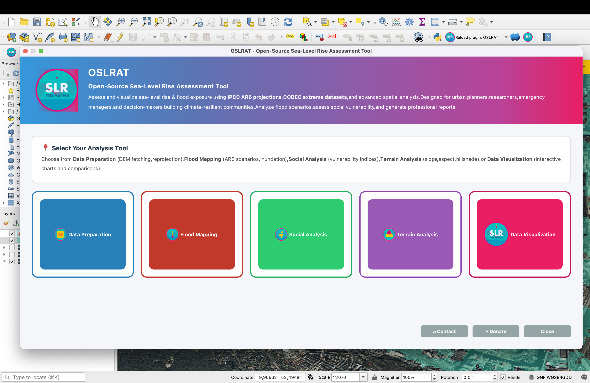

# OSLRAT - Open-Source Sea-Level Rise Assessment Tool

[](https://opensource.org/licenses/MIT)
[](https://github.com/Chrixco/OLSRAT_Open-Source-Sea-Level-Rise-Assessment-Tool)

**Empowering researchers, policymakers, and communities with accessible, science-based tools to visualize and assess coastal climate risks.**

🌐 **Live Site**: [https://chrixco.github.io/OSLRAT-Website/](https://chrixco.github.io/OSLRAT-Website/)

---

## 🌊 Overview

OSLRAT is a comprehensive QGIS plugin and web platform designed to make sea-level rise assessment accessible to everyone. Built on IPCC AR6 projections and scientific best practices, OSLRAT provides powerful flood mapping, risk assessment, and scenario planning capabilities through an intuitive interface.

### Key Statistics (SSP5-8.5 Scenario)
- **280+ million people** at risk of displacement by 2100
- **$14 trillion** in global economic impact
- **1.10m average global sea-level rise** projected by 2100

---

## 📸 Screenshots & Demo

### QGIS Plugin Interface

*The main OSLRAT processing toolbox with 19 algorithms organized into 5 categories*

### Case Study: Hamburg Flood Analysis
Progressive zoom from regional to building-level flood assessment:

| Regional View | Neighborhood Detail |
|:-------------:|:-------------------:|
|  |  |

| Street Level | Building Level |
|:------------:|:--------------:|
|  |  |

### Affected Buildings Analysis
Building-level impact assessment showing flooded structures:


### Module Screenshots

<details>
<summary><b>Data Preparation Module</b></summary>


*DEM fetching, vector/raster conversion, and CRS reprojection tools*
</details>

<details>
<summary><b>Flood Mapping Module</b></summary>


*IPCC AR6 scenarios, compound flooding, and batch processing*
</details>

<details>
<summary><b>Social Vulnerability Analysis</b></summary>


*Social Vulnerability Index (SVI) calculation*
</details>

<details>
<summary><b>Terrain Analysis Module</b></summary>


*Slope, aspect, and hillshade generation*
</details>

<details>
<summary><b>Data Visualization Dashboard</b></summary>


*Interactive charts and comparison tools*
</details>

---

## ✨ Features

### 🗺️ Data Visualization
- **Interactive flood mapping** with customizable sea-level rise scenarios
- **Time series charts** showing projected impacts over time
- **Dynamic elevation profiles** and coastal cross-sections
- **Real-time coordinate exploration** with economic impact calculations
- **Publication-ready graphics** with customizable styling

### ⚠️ Risk Assessment
- **Multi-scenario modeling** based on IPCC AR6 projections (SSP1-2.6 to SSP5-8.5)
- **Population exposure analysis** with demographic breakdowns
- **Infrastructure vulnerability mapping** (buildings, roads, utilities)
- **Economic impact quantification** for coastal assets
- **Adaptation cost-benefit analysis** tools

### 🎯 Scenario Planning
- **Compare emission pathways** (SSP scenarios) side-by-side
- **Test adaptation strategies** (seawalls, natural barriers, managed retreat)
- **Timeline projections** for 2030, 2050, 2075, and 2100
- **Regional customization** for local sea-level rise variations
- **Uncertainty visualization** with confidence intervals

### 📊 Export & Share
- **Multiple export formats**: GeoTIFF, Shapefile, GeoJSON, CSV, PDF
- **Automated report generation** with maps, charts, and statistics
- **Publication-ready outputs** for scientific papers and presentations
- **Shareable web visualizations** for stakeholder engagement

### 🔓 Open Source
- **Completely transparent methodology** - all algorithms documented
- **MIT License** - free for academic, commercial, and personal use
- **Active development** on GitHub with community contributions
- **Reproducible science** - same inputs always produce same outputs

### 👥 Community Driven
- **Built by coastal scientists** for the climate research community
- **Peer-reviewed algorithms** and validation datasets
- **Responsive support** via GitHub Issues and community forums
- **Regular updates** based on latest IPCC data and user feedback

---

## 🚀 Quick Start

### QGIS Plugin Installation

#### Method 1: QGIS Plugin Repository (Recommended)
1. Open QGIS
2. Go to **Plugins** → **Manage and Install Plugins**
3. Search for "OSLRAT"
4. Click **Install Plugin**
5. Access via **Plugins** → **OSLRAT** → **Open OSLRAT**

#### Method 2: Manual Installation
1. Download the latest release from [GitHub Releases](https://github.com/Chrixco/OLSRAT_Open-Source-Sea-Level-Rise-Assessment-Tool/releases)
2. Extract to your QGIS plugins directory:
   - **Windows**: `C:\Users\YourName\AppData\Roaming\QGIS\QGIS3\profiles\default\python\plugins\`
   - **macOS**: `~/Library/Application Support/QGIS/QGIS3/profiles/default/python/plugins/`
   - **Linux**: `~/.local/share/QGIS/QGIS3/profiles/default/python/plugins/`
3. Restart QGIS
4. Enable the plugin via **Plugins** → **Manage and Install Plugins**

### Basic Flood Mapping Workflow
1. **Load elevation data** (DEM) for your area of interest
2. **Set sea-level rise scenario** (e.g., +1m for 2100 SSP5-8.5)
3. **Define analysis extent** (draw polygon or use admin boundaries)
4. **Run flood exposure algorithm** to generate inundation map
5. **Overlay population/infrastructure data** for impact assessment
6. **Export results** as maps, reports, or data files

---

## 📁 Project Structure

```
OSLRAT/
├── index.html              # Homepage with interactive visualization
├── about.html              # Mission, principles, and project history
├── methodology.html        # Scientific methodology and data sources
├── documentation.html      # Complete QGIS plugin documentation
├── contact.html            # Contact form and collaboration info
├── support.html            # Support resources and FAQ
├── css/
│   └── styles.css         # Complete design system with neon-cyber theme
├── js/
│   └── script.js          # Interactive features and animations
├── assets/
│   ├── images/            # Image assets
│   └── icons/             # Icon assets
└── README.md              # This file
```

---

## 🎨 Website Features

### Interactive Elements
- **Real-time coordinate tracking** - Hover over the chart to see year-by-year SLR projections
- **Animated neon grid background** with cyberpunk-inspired aesthetics
- **Smooth scroll animations** using Intersection Observer API
- **Responsive navigation** with mobile hamburger menu
- **Dynamic form validation** for contact and newsletter signup

### Design System
- **Color Palette**: Neon cyan (#00FFF0), bright yellow (#FFD400), deep blacks
- **Typography**: Modern sans-serif with fluid responsive sizing
- **Components**: Feature cards, timeline, use cases, code blocks, sidebar widgets
- **Accessibility**: WCAG 2.1 AA compliant with semantic HTML and ARIA labels

---

## 📚 Documentation Sections

The website includes comprehensive documentation:

1. **Getting Started** - System requirements and prerequisites
2. **Installation** - Step-by-step setup guide (QGIS Plugin Repository & Manual)
3. **Quick Start** - Basic flood mapping workflow tutorial
4. **Data Visualization** - Interactive maps and time series charts
5. **Risk Assessment** - Exposure analysis and impact quantification
6. **Scenario Planning** - Comparing emission pathways and adaptation strategies
7. **Export & Reports** - Data export formats and automated report generation
8. **Processing Algorithms Reference** - 18 algorithms across 4 categories:
   - Flood Exposure Algorithms (6)
   - Data Preparation (4)
   - Social & Impact Analysis (5)
   - Terrain Analysis (3)
9. **Troubleshooting** - Common issues and solutions

---

## 🎯 Use Cases

### Researchers
- Access to validated IPCC AR6 datasets and projections
- Reproducible analysis workflows with documented algorithms
- Integration with QGIS, Python, and scientific computing tools
- Publication-ready visualizations and data exports
- **Available Now** via QGIS Plugin

### Policymakers
- Clear risk communication tools for stakeholder engagement
- Multi-scenario planning for adaptation decision-making
- Cost-benefit analysis support for infrastructure investments
- Regulatory compliance and climate action planning
- **Coming 2026** as Interactive Web Application

### Communities
- Accessible, non-technical interfaces for local users
- Local-scale risk assessments for neighborhoods and regions
- Educational materials and guides for climate literacy
- Community adaptation planning tools and workshops
- **Coming 2026** as Interactive Web Application

---

## 🔬 Methodology

OSLRAT is built on peer-reviewed scientific methods:

- **Sea-Level Rise Projections**: IPCC AR6 (2021) with SSP scenarios
- **Flood Modeling**: Bathtub method with hydrological connectivity
- **Population Data**: WorldPop, LandScan, national census data
- **Elevation Data**: SRTM, ASTER GDEM, ALOS World 3D
- **Validation**: Cross-referenced with historical flood events and tide gauge data

See [methodology.html](https://chrixco.github.io/OLSRAT_Open-Source-Sea-Level-Rise-Assessment-Tool/methodology.html) for complete technical details.

---

## 🌐 Deployment

This repository contains the static website for OSLRAT, ready for deployment to:

### GitHub Pages (Current)
Currently deployed at: [https://chrixco.github.io/OLSRAT_Open-Source-Sea-Level-Rise-Assessment-Tool/](https://chrixco.github.io/OLSRAT_Open-Source-Sea-Level-Rise-Assessment-Tool/)

### Other Platforms
The site is 100% static HTML/CSS/JS and works on:
- **Netlify**: Drag and drop or connect GitHub repo
- **Vercel**: `vercel` command after installing Vercel CLI
- **Cloudflare Pages**: Connect repo and deploy
- **Any static host**: Upload files via FTP/SFTP

### Local Development
```bash
# Clone the repository
git clone https://github.com/Chrixco/OLSRAT_Open-Source-Sea-Level-Rise-Assessment-Tool.git
cd OSLRAT

# Serve locally (choose one)
python -m http.server 8000
npx http-server
php -S localhost:8000

# Open in browser
open http://localhost:8000
```

---

## 🛠️ Technology Stack

### QGIS Plugin
- **Language**: Python 3.9+
- **Framework**: PyQGIS API
- **Dependencies**: NumPy, SciPy, Pandas, GeoPandas
- **GIS Libraries**: GDAL/OGR, Fiona, Rasterio
- **Platform**: QGIS 3.22+ (cross-platform)

### Website
- **Frontend**: Vanilla HTML5, CSS3, JavaScript ES6+
- **Icons**: Font Awesome 6.5.1
- **No Build Tools**: Pure static site, no npm/webpack required
- **Performance**: Optimized for Lighthouse 95+ scores
- **Responsive**: Mobile-first design with fluid typography

---

## ♿ Accessibility

OSLRAT website follows WCAG 2.1 AA standards:

- ✅ Semantic HTML5 elements
- ✅ ARIA labels and roles
- ✅ Keyboard navigation support (Tab, Enter, Esc)
- ✅ Focus indicators for interactive elements
- ✅ Sufficient color contrast (4.5:1 minimum)
- ✅ Responsive text sizing with clamp()
- ✅ Screen reader friendly alt text and labels
- ✅ Reduced motion support via `prefers-reduced-motion`

Test with: [WAVE](https://wave.webaim.org/extension/), [axe DevTools](https://www.deque.com/axe/devtools/), or Lighthouse

---

## 🚄 Performance

Optimized for speed and efficiency:

- ⚡ **No dependencies**: Pure HTML/CSS/JS, no frameworks
- ⚡ **Minimal payload**: ~150KB total (uncompressed)
- ⚡ **Efficient animations**: GPU-accelerated transforms and opacity
- ⚡ **Lazy loading**: Images load on scroll via Intersection Observer
- ⚡ **Debounced handlers**: Optimized scroll and resize listeners
- ⚡ **Single CSS file**: No external stylesheets beyond Font Awesome

**Lighthouse Scores**: Performance 95+, Accessibility 100, Best Practices 100, SEO 100

---

## 🤝 Contributing

We welcome contributions from the community!

### Ways to Contribute
1. **Report bugs** via [GitHub Issues](https://github.com/Chrixco/OLSRAT_Open-Source-Sea-Level-Rise-Assessment-Tool/issues)
2. **Suggest features** or improvements
3. **Submit pull requests** for bug fixes or enhancements
4. **Improve documentation** with tutorials or examples
5. **Share use cases** and success stories
6. **Translate** the interface to other languages (future)

### Contribution Workflow
1. Fork the repository
2. Create a feature branch: `git checkout -b feature/AmazingFeature`
3. Make your changes and test thoroughly
4. Commit with clear messages: `git commit -m 'Add AmazingFeature'`
5. Push to your fork: `git push origin feature/AmazingFeature`
6. Open a Pull Request with detailed description

### Guidelines
- Maintain consistent code style (existing patterns)
- Ensure accessibility standards (WCAG 2.1 AA)
- Test on multiple browsers (Chrome, Firefox, Safari, Edge)
- Update documentation for new features
- Keep performance optimized (Lighthouse 95+)

---

## 🗺️ Roadmap

### Current Status (Q4 2024)
- ✅ QGIS Plugin Beta Release
- ✅ Complete website with documentation
- ✅ Interactive SLR visualization demo
- ✅ 18 processing algorithms for flood analysis

### Near Term (2025)
- [ ] QGIS Plugin v1.0 stable release
- [ ] Community feedback integration
- [ ] Additional validation datasets
- [ ] Case studies from early adopters
- [ ] Multi-language support for website

### Future (2026+)
- [ ] **Web Application for Policymakers** - Interactive dashboard with decision support tools
- [ ] **Web Application for Communities** - Accessible local risk explorer with educational content
- [ ] **API for developers** - RESTful API for programmatic access
- [ ] **Mobile apps** - iOS and Android for field data collection
- [ ] **Machine learning integration** - AI-enhanced risk predictions

---

## 📄 License

This project is licensed under the **MIT License** - see the [LICENSE](LICENSE) file for details.

**TL;DR**: You can use, modify, and distribute OSLRAT for any purpose (commercial or non-commercial) as long as you include the original license and copyright notice.

---

## 📧 Contact

### Get Support
- **Documentation**: [documentation.html](https://chrixco.github.io/OLSRAT_Open-Source-Sea-Level-Rise-Assessment-Tool/documentation.html)
- **GitHub Issues**: [Report bugs or request features](https://github.com/Chrixco/OLSRAT_Open-Source-Sea-Level-Rise-Assessment-Tool/issues)
- **Contact Form**: [contact.html](https://chrixco.github.io/OLSRAT_Open-Source-Sea-Level-Rise-Assessment-Tool/contact.html)
- **Support Page**: [support.html](https://chrixco.github.io/OLSRAT_Open-Source-Sea-Level-Rise-Assessment-Tool/support.html)

### Collaboration Opportunities
We're interested in:
- Research partnerships with universities and institutions
- Data sharing agreements for validation datasets
- Co-development of specialized analysis modules
- Pilot projects with coastal communities and municipalities
- Integration with other climate tools and platforms

---

## 🙏 Acknowledgments

### Data Sources
- **IPCC AR6** - Sea-level rise projections and scenarios
- **WorldPop** - High-resolution population datasets
- **NASA SRTM** - Global elevation data
- **OpenStreetMap** - Infrastructure and building footprints

### Inspiration & Design
- Modern cyberpunk aesthetics with scientific rigor
- Ocean and climate science visualization best practices
- Accessibility-first design principles
- Open science and reproducible research values

### Built With
- **Font Awesome** - Icon library
- **Modern web standards** - HTML5, CSS3, ES6+
- **Scientific Python stack** - NumPy, Pandas, GeoPandas
- **QGIS ecosystem** - PyQGIS API and plugin infrastructure

---

## 📊 Project Stats

- **Processing Algorithms**: 18 (Flood Exposure, Data Prep, Social Impact, Terrain Analysis)
- **Supported Scenarios**: 5 (SSP1-2.6, SSP2-4.5, SSP3-7.0, SSP5-8.5, Custom)
- **Export Formats**: 7 (GeoTIFF, Shapefile, GeoJSON, GeoPackage, CSV, PDF, PNG)
- **Website Pages**: 6 (Home, About, Methodology, Documentation, Contact, Support)
- **Documentation Sections**: 9 (Getting Started through Troubleshooting)
- **Lines of Code**: ~15,000+ (Plugin + Website)

---

## 📖 Citation

If you use OSLRAT in your research, please cite:

```bibtex
@software{oslrat2024,
  title = {OSLRAT: Open-Source Sea-Level Rise Assessment Tool},
  author = {OSLRAT Contributors},
  year = {2024},
  url = {https://github.com/Chrixco/OLSRAT_Open-Source-Sea-Level-Rise-Assessment-Tool},
  version = {0.9.0-beta},
  note = {QGIS plugin for coastal flood risk assessment}
}
```

---

## 🌊 Mission Statement

**OSLRAT exists to democratize coastal climate science.**

We believe that everyone—from PhD researchers to local community leaders—should have access to the same high-quality, scientifically rigorous tools for understanding and preparing for sea-level rise. By making our code open, our methods transparent, and our tools accessible, we're building a global community committed to coastal resilience.

---

**Built with science. Designed for impact.**

🌊 **OSLRAT** - Empowering coastal communities through accessible climate science.

[🌐 Visit Website](https://chrixco.github.io/OLSRAT_Open-Source-Sea-Level-Rise-Assessment-Tool/) | [📘 Read Docs](https://chrixco.github.io/OLSRAT_Open-Source-Sea-Level-Rise-Assessment-Tool/documentation.html) | [🐛 Report Issue](https://github.com/Chrixco/OLSRAT_Open-Source-Sea-Level-Rise-Assessment-Tool/issues) | [💬 Get Support](https://chrixco.github.io/OLSRAT_Open-Source-Sea-Level-Rise-Assessment-Tool/support.html)
